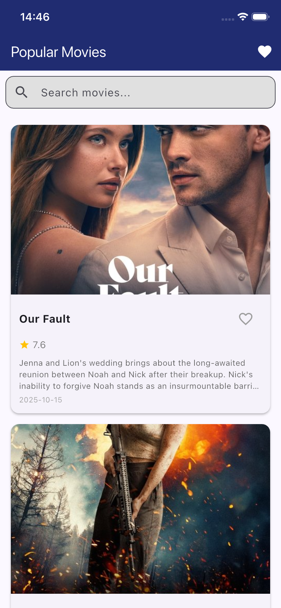
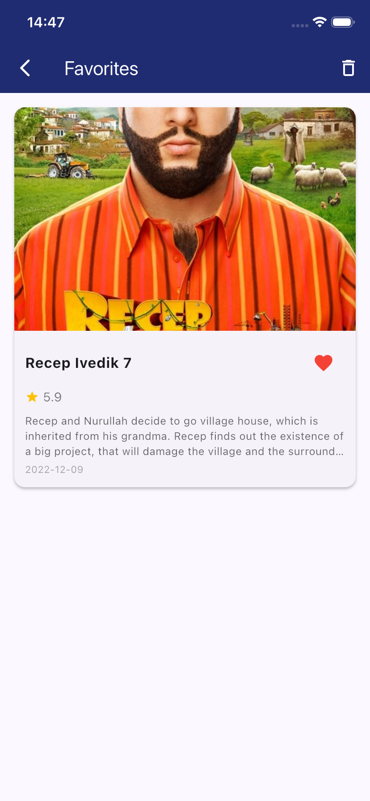

# Movie List App

A Flutter application for browsing popular movies and managing favorites. This app demonstrates clean architecture, SOLID principles, and modern state management using Cubit (from flutter_bloc), Dio for API calls, and SharedPreferences for local storage.

## Screenshots

<p align="center">
  
  
</p>

## Features

- 📱 **Popular Movies Page**: Browse popular movies from TMDB (The Movie Database)
- 🔍 **Search Movies**: Search for movies by title with real-time results
- ❤️ **Favorites**: Add/remove movies to/from your favorites list with undo support
- 📊 **Infinite Scroll**: Automatically load more movies as you scroll
- 💾 **Local Storage**: Favorites persist between app sessions using SharedPreferences
- 🎨 **Modern UI**: Clean and intuitive Material Design interface

## Architecture

This app follows **Clean Architecture** principles with clear separation of concerns:

```
lib/
├── main.dart                    # App entry point with BlocProvider setup
├── config/                      # Configuration files
│   └── api_config.dart         # API base URL and key configuration
├── constants/                   # App-wide constants
│   ├── app_colors.dart         # Color palette
│   ├── app_constants.dart      # Size, padding, and other constants
│   └── app_text_styles.dart    # Text styling constants
├── models/                      # Data models
│   └── movie.dart              # Movie and MovieResponse models
├── services/                    # External services
│   └── movie_api_service.dart  # TMDB API service layer
├── repositories/                # Repository pattern (data abstraction)
│   ├── movie_repository.dart   # Movie data repository
│   └── favorites_repository.dart # Favorites storage repository
├── cubits/                      # State management (Cubit pattern)
│   ├── movie_list_cubit.dart   # Movie list state management
│   └── favorites_cubit.dart    # Favorites state management
├── screens/                     # UI screens
│   ├── movie_list_page.dart    # Main movie list screen
│   └── favorites_page.dart     # Favorites screen
├── theme/                       # App theming
│   └── app_theme.dart          # Material theme configuration
└── widgets/                     # Reusable UI components
    ├── empty_state.dart        # Empty state widget
    ├── loading_indicator.dart  # Loading indicator widget
    ├── search_bar_widget.dart  # Search bar widget
    └── movie_card/             # Movie card component
        ├── movie_card.dart     # Main movie card widget
        └── components/         # Movie card sub-components
            ├── movie_details.dart  # Movie info display
            └── movie_poster.dart   # Movie poster image
```

### SOLID Principles Implementation

This project demonstrates all five SOLID principles:

- **Single Responsibility Principle (SRP)**: Each class has one clear purpose
  - `MovieApiService`: Only handles API calls
  - `MovieRepository`: Only manages movie data
  - `FavoritesRepository`: Only manages favorites storage
  - `MovieListCubit`: Only manages movie list state
  
- **Open-Closed Principle (OCP)**: Open for extension, closed for modification
  - Repository pattern allows switching data sources without changing business logic
  - Cubit can be extended without modifying existing functionality
  
- **Liskov Substitution Principle (LSP)**: Proper inheritance and polymorphism
  - State classes extend base classes correctly
  - Movie models can be substituted anywhere Movie type is expected
  
- **Interface Segregation Principle (ISP)**: Small, focused interfaces
  - Repository pattern provides only necessary methods
  - Each cubit exposes only relevant operations
  
- **Dependency Inversion Principle (DIP)**: Depends on abstractions, not concretions
  - Cubits depend on repository interfaces, not concrete implementations
  - UI depends on state abstractions, not specific implementations

## Setup Instructions

### 1. Get Your TMDB API Key

1. Go to [https://www.themoviedb.org/settings/api](https://www.themoviedb.org/settings/api)
2. Create an account or log in
3. Request an API key
4. Copy your API key

### 2. Add API Key to the App

1. Open `lib/config/api_config.dart`
2. Replace `YOUR_API_KEY_HERE` with your actual TMDB API key:

```dart
static const String apiKey = 'your_actual_api_key_here';
```

### 3. Install Dependencies

```bash
flutter pub get
```

### 4. Run the App

```bash
flutter run
```

## Technologies Used

- **Flutter**: Cross-platform UI framework
- **flutter_bloc (Cubit)**: State management without events - simpler than full BLoC
- **Dio**: Modern HTTP client for API requests with interceptors
- **SharedPreferences**: Persistent local storage for favorites
- **Equatable**: Value equality for efficient state comparison and preventing unnecessary rebuilds

## Dependencies

```yaml
dependencies:
  flutter:
    sdk: flutter
  flutter_bloc: ^8.1.3       # State management
  dio: ^5.4.0                 # HTTP client
  shared_preferences: ^2.2.2  # Local storage
  equatable: ^2.0.5           # Value equality
```

## How to Use

### Movie List Page

1. The app opens with popular movies from TMDB
2. **Scroll down** to automatically load more movies (infinite scroll pagination)
3. **Tap the search bar** to search for specific movies by title
4. **Tap the heart icon** (outline) on any movie card to add it to favorites
5. **Tap the favorites icon** in the app bar to navigate to your favorites page

### Favorites Page

1. View all your favorited movies stored locally
2. **Tap the filled heart icon** to remove a movie from favorites
3. **Tap "Undo"** in the snackbar to restore a removed favorite
4. **Tap the trash icon** in the app bar to clear all favorites (with confirmation dialog)

## Project Structure Benefits

- **Testability**: Clear separation of concerns makes unit testing straightforward
- **Maintainability**: Easy to modify and extend without breaking existing code
- **Readability**: Clear organization, naming conventions, and extensive documentation
- **Scalability**: Easy to add new features without refactoring
- **Reusability**: Components can be reused across different parts of the app
- **Performance**: Optimized with Equatable to prevent unnecessary rebuilds

## Notes & Best Practices

- Ensure you have a stable internet connection to load movies from TMDB API
- Favorites are stored locally and persist between app restarts
- The TMDB API has rate limits - avoid making excessive requests
- Search functionality debounces to avoid unnecessary API calls
- Error states are handled gracefully with retry options
- Loading states provide user feedback during async operations
- Undo functionality uses snackbar for better UX

## API Information

This app uses [The Movie Database (TMDB) API](https://www.themoviedb.org/documentation/api) to fetch movie data. You'll need to create a free account and obtain an API key to use this app.

**API Endpoints Used:**
- `/movie/popular` - Get popular movies with pagination
- `/search/movie` - Search movies by query string

## License

This project is created for educational purposes.
